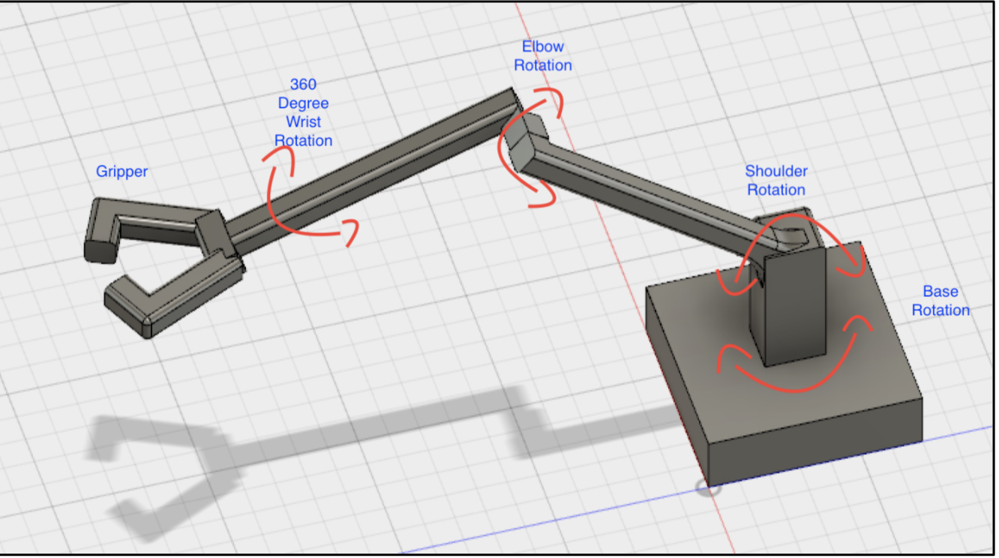
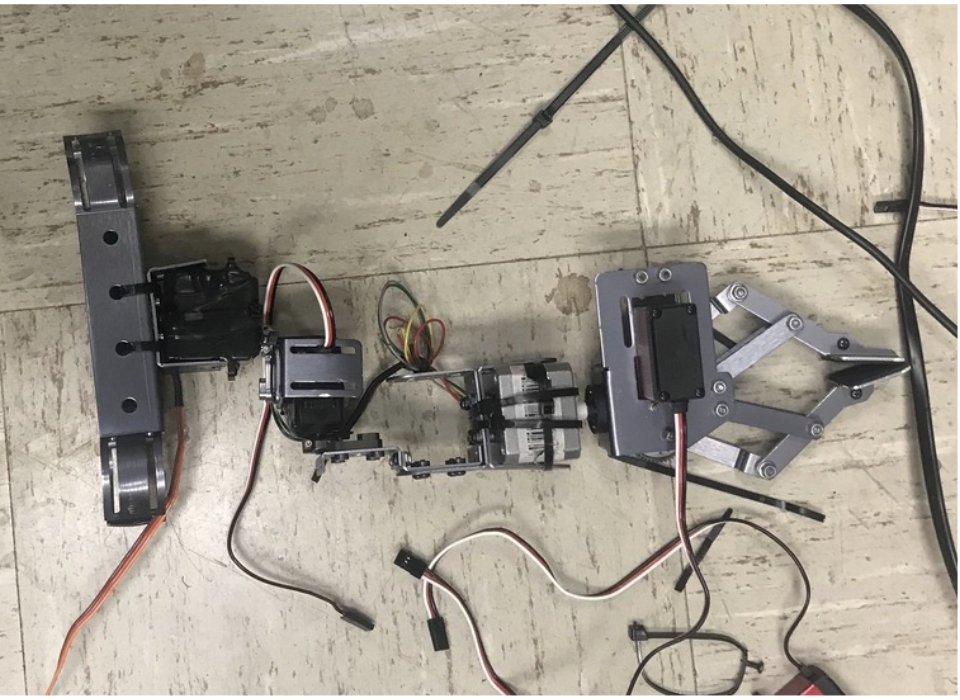

---
layout: project
type: project
image: images/arm.png
title: Master and Slave Robot Arm
permalink: projects/arm
# All dates must be YYYY-MM-DD format!
date: 2018-04-01
labels:
  - Robotics
  - Arduino
  - C++
  - Servo motors
summary: This is my own project which is making robot arm at home.
--- 
 
 

   
    
 

 
 Master and Slave Robot Arm has two major parts: arm control and the robot arm. The arm control will design base on the design of the robot arm. In another word, it looks like two identical arm. Whenever the arm control move the robot arm will follow the same direction. 
 
 I learned a lot from this project since I have to do everything from designing, wiring, programming. I tried both Raspberry pi 3B and Arduino to make the arm. Although both of them was worked, I ended up using the Arduino for the prototype and final product.

 You can see my prototype video at <a href="https://youtu.be/BlIY0Qh8HyA">here</a>.
 
 
