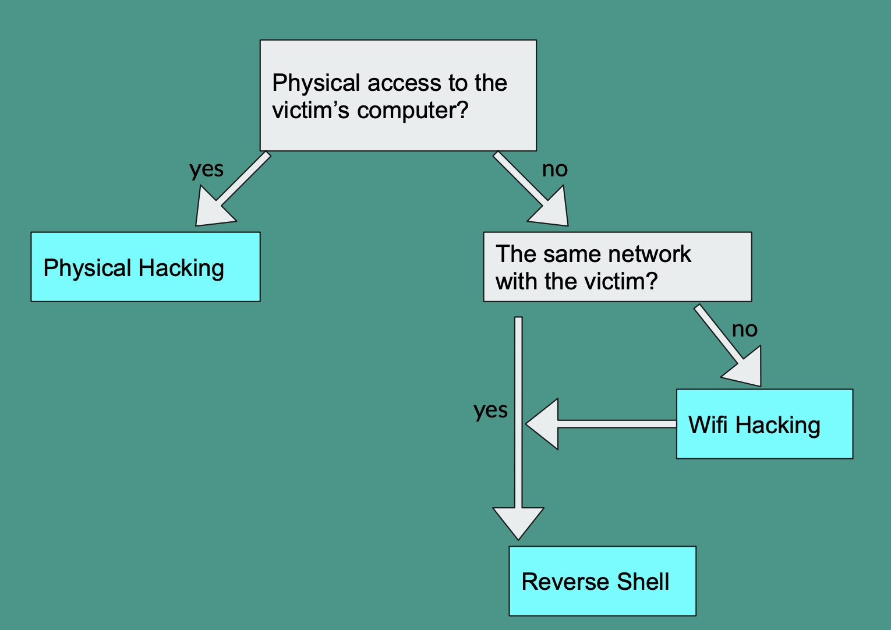

Cybersecurity is an area that is continually growing. Hackers are always seeking to discover different ways to infiltrate systems and connections. Ethical Hacking also called as Penetration Testing is a performance of intruding into system or networks to discover out threats, vulnerabilities in those operations which a malicious intruder may locate and exploit generating the loss of data, financial loss or other significant damages.  The goal of ethical hacking is to enhance the security of the network or systems by establishing the vulnerabilities discovered during testing. 

Kali Linux is a Debian-derived Linux distribution designed for digital forensics and penetration testing. Kali has over 600 different applications and cybersecurity testing tools pre-installed and ready to use

Our project based on three scenarios are physical access, wifi hacking and reverse shell. 

You can see more at the [Doc](https://docs.google.com/document/d/1cFcWZNj2SoA4KSd9V5U5qjElGxbcJjzwJsPCG3aBR08/edit?usp=sharing) .
