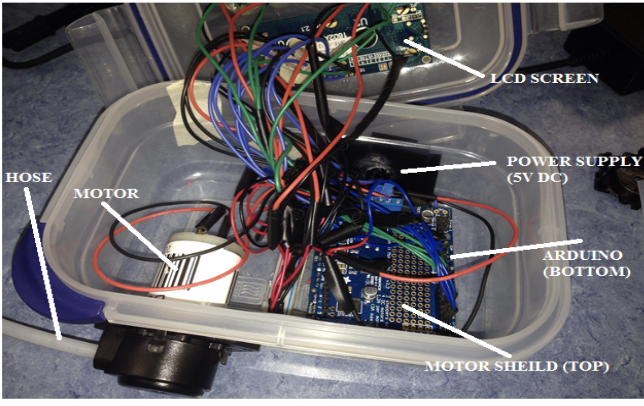

My team developed a Peristaltic Pump machine for the microchemistry lab at Kapiolani Community College, at the end of the semester we have a working device for the lab.

 
 This is the prototype for the project.

Peristaltic Pump machine pumps fluid without contaminating the liquid itself, mainly used in pharmaceutical applications and the food industry, prevents backflow, gentle - ideal for use on cells and proteins, and precise dispensing.

The purpose of the project is beneficial to the biology department since the cost to build is less than the cost of buying. We ran multiple trials using the same volume to figure out the function of our machine over time. We plotted the results onto a graph. Our results showed that with secondary volumes, the role of the motor was linear versus as the volume increased, it began to show a nonlinear pattern. The idea was to create a formula that we would be able to input into our code and have the Arduino dispense volume as a function of time.

 This is the 3D model I did for the machine.
 
 
In the end, we were pleased with our results. Our data shows that our dispensing volumes are precise with a minimal percent error, considering this is our prototype. Currently, we are working on a newer model, where we have transitioned to using a stepper motor that will give us a much accurate and precise result with dispensing and speed.
 
 I and another person in the group collecting data for a correct amount.
 

This project I gained experience with 3D printer design software Autodesk, custom circuits software Eagle, Arduino, data collection, and data analysis.

I use Eagle program to design the schematic.

