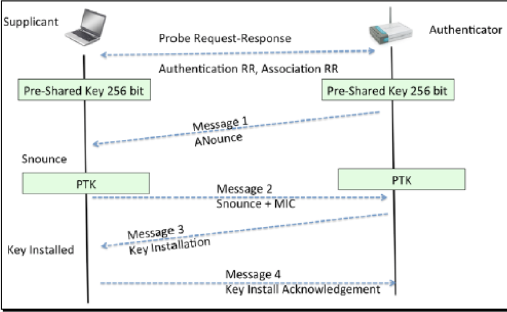
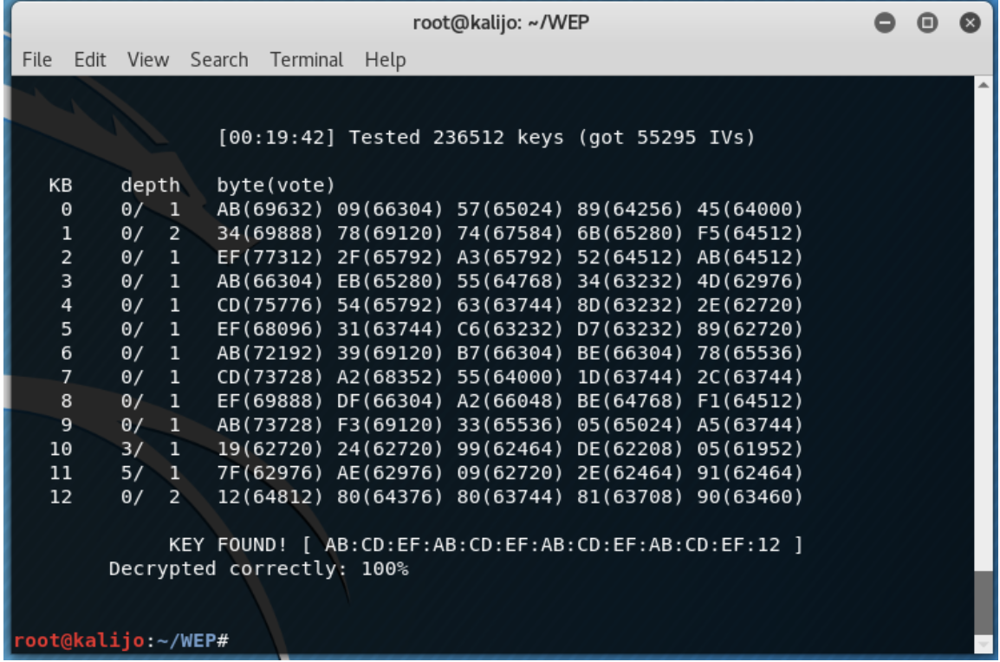
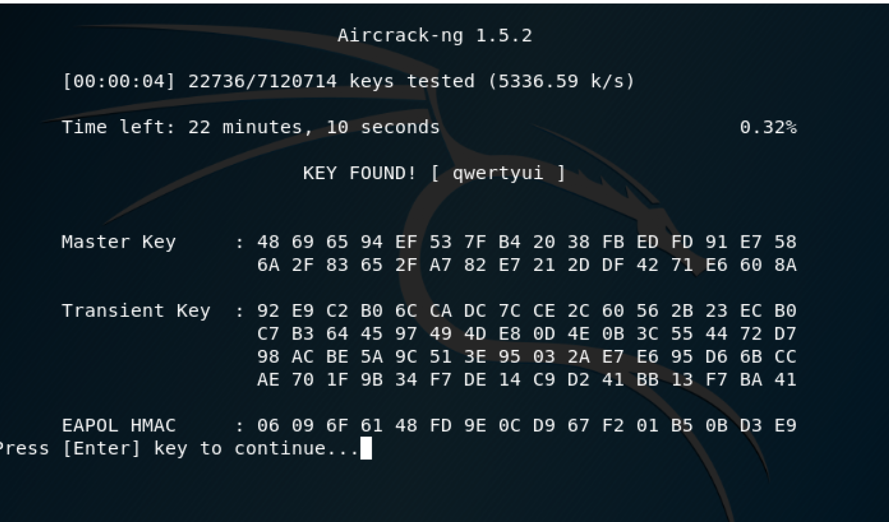

Cybersecurity is now at the lead of policy considerations and preparing for future conflicts. In many forms, the cyber threat has developed the active field, and that gives unique attention to the United States and its allies. 

Kali Linux is a Debian-derived Linux distribution designed for digital forensics and penetration testing. Kali has over 600 different applications and cybersecurity testing tools pre-installed and ready to use

The several popular forms of wifi encryption including WEP, WPA, and WPA2 were studied and cracked during the semester. There are also bypass hidden SSIDs and MAC filtering protocol. Also, we reviewed primary methods of such as the Honeypot and Evil-twin attacks, which attacked the closer distance and re-authentication settings of current network administrators. Using these procedures demand our wifi card to be in promiscuous mode or monitor mode. Monitor mode is when the wireless interface/card can obtain data about, or sniff, the wireless traffic in the area. This mode is usually the initial action in using the aircrack-ng suite. This action is performed via the terminal by entering “airmon-ng start [name of wireless interface]”, but somehow it did not work for my wifi card. I had to use "iwconfig mode monitor [name of wireless interface]" instead. In most of the time, you will have to indicate the name allocated to your wifi card by inserting the command iwconfig, and you can verify the status of the interfaces by adding the command ifconfig.

Success cracked WEP and WPA

You can see more at the [Doc](https://docs.google.com/document/d/1oF0-3h837eV8ok8ITvkn4ULBXB_EcUXuAeYkwU6g3Rg/edit?usp=sharing) .
